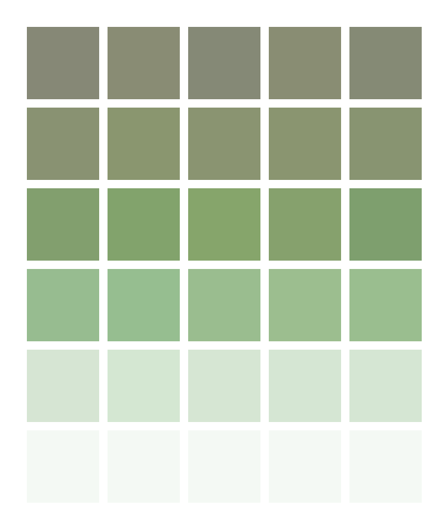

# My Wordle

I've been keeping a running list of my Wordle games for a few months.  (Not just
the famously copy-pasteable emoji-color patterns, but the specific words.)

Now I can visualize my "average Wordle," in the sense of: if I average all my
games together, what's the mean color value of each grid element?

Answer (for the 168 puzzles on file as of July 18, 2022):



## Usage

### Input file format

Provide a text file where your actual guessed words are placed in blocks, with
each block is separated by one or more blank lines.  Lines starting with `--`
are ignored (allowing you to add whole-line comments).

The file `test_history.txt` gives an example with two puzzles:

```
-- Apr 5, 2022  (treated as a comment)
SLANT
TALON
NATAL

-- Apr 4, 2022
LORDS
SLANT
SCALE
SHAWL
```

### Running the script

Once you have a text file copy of all your puzzles, generate a PNG with:

```
$ python wordle_mean.py wordle_history.txt output.png
```

## Python environment

I've installed Pillow in a Python 3 virtual environment:

```
$ pip install Pillow
```

Currently looks like:

```
$ pip freeze
Pillow==9.1.0
```

That should be all you need to run the Python script.

## TODO

1.  I'd like to look at whether I tend to guess words that are too rare, or too
    common, compared to the typical answer.
2.  I'd like to make a
    ["tank-counting problem"](https://en.wikipedia.org/wiki/German_tank_problem)
    estimate of the total number of words Wordle can use as an answer.
